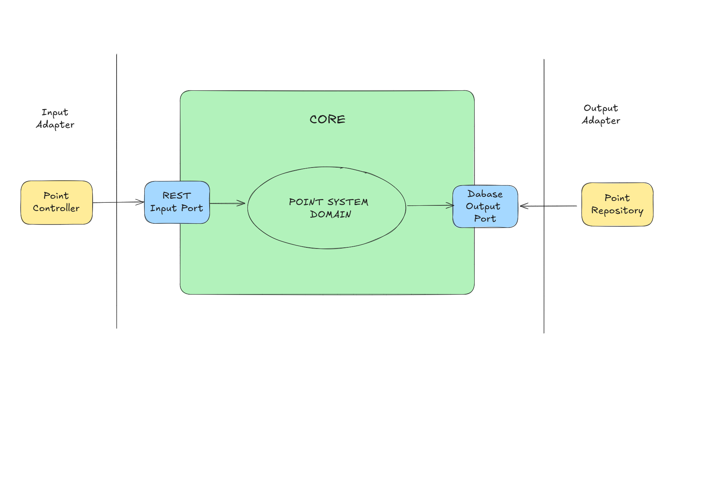

# PointSystem

## Project Structure

The project follows the ***Hexagonal Architecture**.
The main reason for me to choose this architecture is that it allows us to separate the core business logic from its application interface.

1. **Core Layer**, this is the core business layer. It has the following sub-packages:
   - **domain**, contains:
       - **entity**, represents our business domain model.
       - **dto**, represents our data transfer object.
       - **service**, represents our business domain service.
   - **port**, which basically is our interface to the outside world or the client. This layer has the following sub-packages:
       - **input**, used to receive any request from the client's infrastructure.
       - **output**,used to such as writing into a database, calling an external API, etc.
2. **Adapter Layer**, this is the layer that represents our infrastructure layer such as frameworks, database, etc. It has the following sub-packages:
   - **input**, the input adapter that is used to receive any request from the clients.
   - **output**, the output adapter that is used to write into a database, etc.

